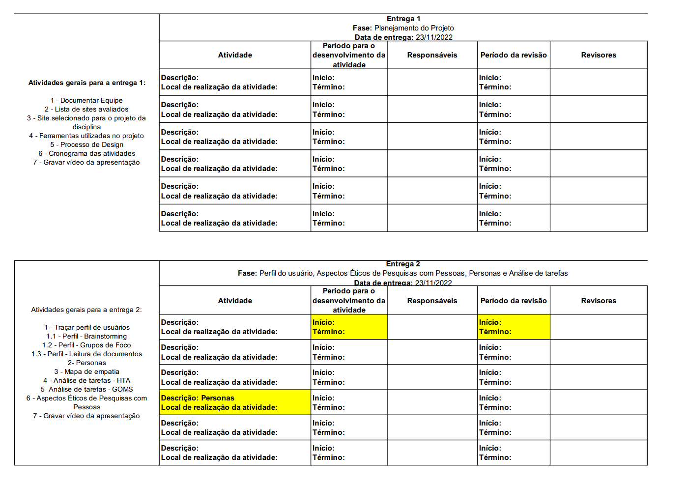

<!--
Célula genérica da tabela para facilitar a criação e a manutenção:
| - | - | Início: -  Fim: - | - | Início: -  Fim: - | - |
-->
## Introdução
Nessa página estão contidos os cronogramas para a realização do projeto de IHC do semestre 2026.1.
Esse Google Docs/ VScode foi estruturado com o objetivo de servir como um guia de quais tarefas realizar e também como um ponto de controle de como as tarefas estão sendo realizadas.

---

## Entrega 1

### Expectativa:

<b>Tabela 1</b> - Planejamento do projeto e processo de design

| Atividade | Local | Período para o desenvolvimento das atividades | Responsáveis | Período para a revisão | Revisores |
| --------------------------------- | ---------------- | --------------------- | ------------------ | ---------------------------- | ----------------|
| Planejamento da equipe | Discord | Início: 01/04  Fim: 02/04 | [Rafael](https://github.com/Romm-0) | Início: 03/04  Fim: 03/04 | [Yasmim](https://github.com/YasminDayrell) |
| Planejamento do projeto | Discord | Início: 01/04  Fim: 03/04 | [Heyttor](https://github.com/H3ytt0r62), [Giovanna](https://github.com/giovannabrito19) | Início: 04/04  Fim: 04/04 | [João](https://github.com/Blazemorales), [Rafael](https://github.com/Romm-0) |
| Heatmap de disponibilidade | Discord | Início: 02/04  Fim: 05/04 | [Yasmim](https://github.com/YasminDayrell), [Heyttor](https://github.com/H3ytt0r62) | Início: 06/04  Fim: 06/04 | [Giovanna](https://github.com/giovannabrito19) |
| Lista de sites avaliados | Google Docs/ VScode | Início: 03/04  Fim: 06/04 | [Heyttor](https://github.com/H3ytt0r62) | Início: 07/04  Fim: 07/04 | [Lucas](https://github.com/lucaszg-g) |
| Definição das ferramentas | Google Docs/ VScode | Início: 05/04  Fim: 07/04 | [Thiago](https://github.com/thgomxs) | Início: 08/04  Fim: 08/04 | [Heyttor](https://github.com/H3ytt0r62) |
| Definição do processo de design | Google Docs/ VScode | Início: 06/04  Fim: 08/04 | [Lucas](https://github.com/lucaszg-g), [Yasmim](https://github.com/YasminDayrell) | Início: 09/04  Fim: 09/04 | [Giovanna](https://github.com/giovannabrito19), [Rafael](https://github.com/Romm-0) |
| Justificar site selecionado | Google Docs/ VScode | Início: 07/04  Fim: 08/04 | [João](https://github.com/Blazemorales) | Início: 09/04  Fim: 09/04 | [Thiago](https://github.com/thgomxs) |
| Elaboração do cronograma | Google Docs/ VScode | Início: 07/04  Fim: 09/04 | [Giovanna](https://github.com/giovannabrito19), [Rafael](https://github.com/Romm-0) | Início: 10/04  Fim: 10/04 | [Heyttor](https://github.com/H3ytt0r62), [Yasmim](https://github.com/YasminDayrell) |
| Criar github pages | Github | Início: 07/04  Fim: 09/04 | [Heyttor](https://github.com/H3ytt0r62) | Início: 09/04  Fim: 09/04 | [Giovanna](https://github.com/giovannabrito19), [Heyttor](https://github.com/H3ytt0r62), [João](https://github.com/Blazemorales), [Lucas](https://github.com/lucaszg-g), [Rafael](https://github.com/Romm-0), [Thiago](https://github.com/thgomxs) e [Yasmim](https://github.com/YasminDayrell) |
| Gravação do vídeo | OBS | Início: 10/04  Fim: 10/04 | [Giovanna](https://github.com/giovannabrito19), [Heyttor](https://github.com/H3ytt0r62), [João](https://github.com/Blazemorales), [Lucas](https://github.com/lucaszg-g), [Rafael](https://github.com/Romm-0), [Thiago](https://github.com/thgomxs) e [Yasmim](https://github.com/YasminDayrell) | Início: 10/04  Fim: 10/04 | [Giovanna](https://github.com/giovannabrito19), [Heyttor](https://github.com/H3ytt0r62), [João](https://github.com/Blazemorales), [Lucas](https://github.com/lucaszg-g), [Rafael](https://github.com/Romm-0), [Thiago](https://github.com/thgomxs) e [Yasmim](https://github.com/YasminDayrell) |
| Preparar apresentação etapa 1 | Discord | Início: 11/04  Fim: 11/04 | [Giovanna](https://github.com/giovannabrito19), [Heyttor](https://github.com/H3ytt0r62), [João](https://github.com/Blazemorales), [Lucas](https://github.com/lucaszg-g), [Rafael](https://github.com/Romm-0), [Thiago](https://github.com/thgomxs) e [Yasmim](https://github.com/YasminDayrell) | Início: 12/04  Fim: 12/04 | [João](https://github.com/Blazemorales) |
| Entrega da apresentação etapa 1 | Aprender3 | Data: 12/04 | - | - | - |
| Inspeção grupo+1 etapa 1 | Discord | Início: 12/04  Fim: 13/04 | [Giovanna](https://github.com/giovannabrito19), [Heyttor](https://github.com/H3ytt0r62), [João](https://github.com/Blazemorales), [Lucas](https://github.com/lucaszg-g), [Rafael](https://github.com/Romm-0), [Thiago](https://github.com/thgomxs) e [Yasmim](https://github.com/YasminDayrell) | Início: 13/04  Fim: 13/04 | [Rafael](https://github.com/Romm-0) |
| Correção pós-inspeção | Discord | Início: 13/04  Fim: 13/04 | [Giovanna](https://github.com/giovannabrito19), [Heyttor](https://github.com/H3ytt0r62), [João](https://github.com/Blazemorales), [Lucas](https://github.com/lucaszg-g), [Rafael](https://github.com/Romm-0), [Thiago](https://github.com/thgomxs) e [Yasmim](https://github.com/YasminDayrell) | Início: 13/04  Fim: 13/04 | [Giovanna](https://github.com/giovannabrito19), [Yasmim](https://github.com/YasminDayrell) |
| Apresentação etapa 1 | Sala de Sala de Aula | Data: 14/04 | - | - | - |
| Correções pós apresentação | Discord | Início: 14/04  Fim: 15/04 | [Giovanna](https://github.com/giovannabrito19), [Heyttor](https://github.com/H3ytt0r62), [João](https://github.com/Blazemorales), [Lucas](https://github.com/lucaszg-g), [Rafael](https://github.com/Romm-0), [Thiago](https://github.com/thgomxs) e [Yasmim](https://github.com/YasminDayrell) | Início: 16/04  Fim: 17/04 | [Thiago](https://github.com/thgomxs), [Rafael](https://github.com/Romm-0) |

Autor: [Giovanna Aguiar](https://github.com/giovannabrito19) e [Rafael Melatti](https://github.com/Romm-0).

###  Realidade: 
Entrega não finalizada

---

## Entrega 2

### Expectativa:

<b>Tabela 2</b> - Perfil do usuário, Aspectos Éticos e Análise de tarefas

| Atividade | Local | Período para o desenvolvimento das atividades | Responsáveis | Período para a revisão | Revisores |
| --------------------------------- | ---------------- | --------------------- | ------------------ | ---------------------------- | ----------------|
| Definição do perfil do usuário | Google Docs/ VScode | Início: 18/04  Fim: 22/04 | [Thiago](https://github.com/thgomxs) | Início: 23/04  Fim: 23/04 | [Lucas](https://github.com/lucaszg-g), [Heyttor](https://github.com/H3ytt0r62) |
| Levantamento de aspectos éticos | Google Docs/ VScode | Início: 16/04  Fim: 22/04 | [Rafael](https://github.com/Romm-0), [Heyttor](https://github.com/H3ytt0r62), [Yasmim](https://github.com/YasminDayrell) | Início: 23/04  Fim: 23/04 | [João](https://github.com/Blazemorales), [Thiago](https://github.com/thgomxs) |
| Análise de tarefas | Miro | Início: 22/04  Fim: 30/04 | [João](https://github.com/Blazemorales), [Lucas](https://github.com/lucaszg-g) | Início: 01/05  Fim: 01/05 | [Yasmim](https://github.com/YasminDayrell), [Rafael](https://github.com/Romm-0) |
| Gravação do vídeo | OBS | Início: 02/05  Fim: 02/05 | [Heyttor](https://github.com/H3ytt0r62), [João](https://github.com/Blazemorales), [Lucas](https://github.com/lucaszg-g), [Rafael](https://github.com/Romm-0), [Thiago](https://github.com/thgomxs) e [Yasmim](https://github.com/YasminDayrell) | Início: 02/05  Fim: 02/05 | [Heyttor](https://github.com/H3ytt0r62), [João](https://github.com/Blazemorales), [Lucas](https://github.com/lucaszg-g), [Rafael](https://github.com/Romm-0), [Thiago](https://github.com/thgomxs) e [Yasmim](https://github.com/YasminDayrell) |
| Preparar apresentação etapa 2 | Discord | Início: 02/05  Fim: 03/05 | [Heyttor](https://github.com/H3ytt0r62), [João](https://github.com/Blazemorales), [Lucas](https://github.com/lucaszg-g), [Rafael](https://github.com/Romm-0), [Thiago](https://github.com/thgomxs) e [Yasmim](https://github.com/YasminDayrell) | Início: 03/05  Fim: 03/05 | [Lucas](https://github.com/lucaszg-g) |
| Entrega da apresentação etapa 2 | Aprender3 | Data: 03/05 | - | - | - |
| Inspeção grupo-1 etapa 2 | Discord | Início: 03/05  Fim: 04/05 | [Heyttor](https://github.com/H3ytt0r62), [João](https://github.com/Blazemorales), [Lucas](https://github.com/lucaszg-g), [Rafael](https://github.com/Romm-0), [Thiago](https://github.com/thgomxs) e [Yasmim](https://github.com/YasminDayrell) | Início: 04/05  Fim: 04/05 | [Yasmim](https://github.com/YasminDayrell) |
| Correção pós-inspeção | Discord | Início: 04/05  Fim: 04/05 | [Heyttor](https://github.com/H3ytt0r62), [João](https://github.com/Blazemorales), [Lucas](https://github.com/lucaszg-g), [Rafael](https://github.com/Romm-0), [Thiago](https://github.com/thgomxs) e [Yasmim](https://github.com/YasminDayrell) | Início: 04/05  Fim: 04/05 | [Heyttor](https://github.com/H3ytt0r62), [Rafael](https://github.com/Romm-0) |
| Apresentação etapa 2 | Sala de Aula | Data: 05/05 | - | - | - |
| Correções pós apresentação | Discord | Início: 05/05  Fim: 06/05 | [Heyttor](https://github.com/H3ytt0r62), [João](https://github.com/Blazemorales), [Lucas](https://github.com/lucaszg-g), [Rafael](https://github.com/Romm-0), [Thiago](https://github.com/thgomxs) e [Yasmim](https://github.com/YasminDayrell) | Início: 07/05  Fim: 07/05 | [Lucas](https://github.com/lucaszg-g) |

Autor: [Giovanna Aguiar](https://github.com/giovannabrito19) e [Rafael Melatti](https://github.com/Romm-0).

###  Realidade: 
Entrega não finalizada

---

## Entrega 3

### Expectativa:

<b>Tabela 3</b> - Princípios e Guia de Estilo

| Atividade | Local | Período para o desenvolvimento das atividades | Responsáveis | Período para a revisão | Revisores |
| --------------------------------- | ---------------- | --------------------- | ------------------ | ---------------------------- | ----------------|
| Criação do guia de estilo | Figma | Início: 04/05  Fim: 10/05 | [Lucas](https://github.com/lucaszg-g), [Heyttor](https://github.com/H3ytt0r62) | Início: 11/05  Fim: 11/05 | [Rafael](https://github.com/Romm-0), [João](https://github.com/Blazemorales) |
| Definição dos princípios do projeto | Google Docs/ VScode | Início: 05/05  Fim: 09/05 | [Rafael](https://github.com/Romm-0), [João](https://github.com/Blazemorales) | Início: 10/05  Fim: 10/05 | [Yasmim](https://github.com/YasminDayrell), [Thiago](https://github.com/thgomxs) |
| Definição das metas de usabilidade | Google Docs/ VScode | Início: 05/05  Fim: 09/05 | [Yasmim](https://github.com/YasminDayrell), [Thiago](https://github.com/thgomxs) | Início: 10/05  Fim: 10/05 | [Lucas](https://github.com/lucaszg-g) |
| Aprimorar github pages | Github | Início: 05/05  Fim: 08/05 | [Heyttor](https://github.com/H3ytt0r62), [Rafael](https://github.com/Romm-0), [João](https://github.com/Blazemorales) | Início: 09/05  Fim: 09/05 | [Heyttor](https://github.com/H3ytt0r62), [João](https://github.com/Blazemorales), [Lucas](https://github.com/lucaszg-g), [Rafael](https://github.com/Romm-0), [Thiago](https://github.com/thgomxs) e [Yasmim](https://github.com/YasminDayrell) |
| Características da plataforma | Google Docs/ VScode | Início: 06/05  Fim: 09/05 | [Lucas](https://github.com/lucaszg-g) | Início: 10/05  Fim: 10/05 | [Heyttor](https://github.com/H3ytt0r62) |
| Gravação do vídeo | OBS | Início: 11/05  Fim: 11/05 | [Heyttor](https://github.com/H3ytt0r62), [João](https://github.com/Blazemorales), [Lucas](https://github.com/lucaszg-g), [Rafael](https://github.com/Romm-0), [Thiago](https://github.com/thgomxs) e [Yasmim](https://github.com/YasminDayrell) | Início: 11/05  Fim: 11/05 | [Heyttor](https://github.com/H3ytt0r62), [João](https://github.com/Blazemorales), [Lucas](https://github.com/lucaszg-g), [Rafael](https://github.com/Romm-0), [Thiago](https://github.com/thgomxs) e [Yasmim](https://github.com/YasminDayrell) |
| Preparar apresentação etapa 3 | Discord | Início: 11/05  Fim: 12/05 | [Heyttor](https://github.com/H3ytt0r62), [João](https://github.com/Blazemorales), [Lucas](https://github.com/lucaszg-g), [Rafael](https://github.com/Romm-0), [Thiago](https://github.com/thgomxs) e [Yasmim](https://github.com/YasminDayrell) | Início: 12/05  Fim: 12/05 | [Heyttor](https://github.com/H3ytt0r62), [João](https://github.com/Blazemorales), [Lucas](https://github.com/lucaszg-g), [Rafael](https://github.com/Romm-0), [Thiago](https://github.com/thgomxs) e [Yasmim](https://github.com/YasminDayrell) |
| Entrega da apresentação etapa 3 | Aprender3 | Data: 12/05 | - | - | - |
| Inspeção grupo+1 etapa 3 | Discord | Início: 12/05  Fim: 13/05 | [Heyttor](https://github.com/H3ytt0r62), [João](https://github.com/Blazemorales), [Lucas](https://github.com/lucaszg-g), [Rafael](https://github.com/Romm-0), [Thiago](https://github.com/thgomxs) e [Yasmim](https://github.com/YasminDayrell) | Início: 13/05  Fim: 13/05 | - |
| Correção pós-inspeção | Discord | Início: 13/05  Fim: 13/05 | [Heyttor](https://github.com/H3ytt0r62), [João](https://github.com/Blazemorales), [Lucas](https://github.com/lucaszg-g), [Rafael](https://github.com/Romm-0), [Thiago](https://github.com/thgomxs) e [Yasmim](https://github.com/YasminDayrell) | Início: 13/05  Fim: 13/05 | [João](https://github.com/Blazemorales), [Lucas](https://github.com/lucaszg-g) |
| Apresentação etapa 3 | Sala de Aula | Data: 14/05 | - | - | - |
| Correções pós apresentação | Discord | Início: 14/05  Fim: 15/05 | [Heyttor](https://github.com/H3ytt0r62), [João](https://github.com/Blazemorales), [Lucas](https://github.com/lucaszg-g), [Rafael](https://github.com/Romm-0), [Thiago](https://github.com/thgomxs) e [Yasmim](https://github.com/YasminDayrell) | Início: 16/05  Fim: 16/05 | [Thiago](https://github.com/thgomxs), [Yasmim](https://github.com/YasminDayrell) |

Autor: [Giovanna Aguiar](https://github.com/giovannabrito19) e [Rafael Melatti](https://github.com/Romm-0).

###  Realidade: 
Entrega não finalizada

---

## Entrega 4

### Expectativa:

<b>Tabela 4</b> - Planejamento da Avaliação e Storyboard

| Atividade | Local | Período para o desenvolvimento das atividades | Responsáveis | Período para a revisão | Revisores |
| --------------------------------- | ---------------- | --------------------- | ------------------ | ---------------------------- | ----------------|
| Planejamento da avaliação do storyboard | Miro | Início: 11/05  Fim: 14/05 | [Heyttor](https://github.com/H3ytt0r62), [Rafael](https://github.com/Romm-0) | Início: 15/05  Fim: 15/05 | [João](https://github.com/Blazemorales) |
| Planejamento da avaliação da análise de tarefas | Miro | Início: 12/05  Fim: 16/05 | [Lucas](https://github.com/lucaszg-g), [Yasmim](https://github.com/YasminDayrell) | Início: 17/05  Fim: 17/05 | [Thiago](https://github.com/thgomxs) |
| Planejamento do relato (storyboard) | Google Docs/ VScode | Início: 14/05  Fim: 17/05 | [João](https://github.com/Blazemorales), [Yasmim](https://github.com/YasminDayrell) | Início: 18/05  Fim: 18/05 | [Lucas](https://github.com/lucaszg-g), [Yasmim](https://github.com/YasminDayrell) |
| Planejamento do relato (análise de tarefas) | Google Docs/ VScode | Início: 14/05  Fim: 17/05 | [Thiago](https://github.com/thgomxs) | Início: 18/05  Fim: 18/05 | [Heyttor](https://github.com/H3ytt0r62), [Rafael](https://github.com/Romm-0) |
| Gravação do vídeo | OBS | Início: 18/05  Fim: 18/05 | [Heyttor](https://github.com/H3ytt0r62), [João](https://github.com/Blazemorales), [Lucas](https://github.com/lucaszg-g), [Rafael](https://github.com/Romm-0), [Thiago](https://github.com/thgomxs) e [Yasmim](https://github.com/YasminDayrell) | Início: 18/05  Fim: 18/05 | [Heyttor](https://github.com/H3ytt0r62), [João](https://github.com/Blazemorales), [Lucas](https://github.com/lucaszg-g), [Rafael](https://github.com/Romm-0), [Thiago](https://github.com/thgomxs) e [Yasmim](https://github.com/YasminDayrell) |
| Preparar apresentação etapa 4 | Discord | Início: 18/05  Fim: 19/05 | [Heyttor](https://github.com/H3ytt0r62), [João](https://github.com/Blazemorales), [Lucas](https://github.com/lucaszg-g), [Rafael](https://github.com/Romm-0), [Thiago](https://github.com/thgomxs) e [Yasmim](https://github.com/YasminDayrell) | Início: 19/05  Fim: 19/05 | [Yasmim](https://github.com/YasminDayrell) |
| Entrega da apresentação etapa 4 | Aprender3 | Data: 19/05 | - | - | - |
| Inspeção grupo+1 etapa 4 | Discord | Início: 19/05  Fim: 20/05 | [Heyttor](https://github.com/H3ytt0r62), [João](https://github.com/Blazemorales), [Lucas](https://github.com/lucaszg-g), [Rafael](https://github.com/Romm-0), [Thiago](https://github.com/thgomxs) e [Yasmim](https://github.com/YasminDayrell) | Início: 20/05  Fim: 20/05 | [Heyttor](https://github.com/H3ytt0r62) |
| Correção pós-inspeção | Discord | Início: 20/05  Fim: 20/05 | [Heyttor](https://github.com/H3ytt0r62), [João](https://github.com/Blazemorales), [Lucas](https://github.com/lucaszg-g), [Rafael](https://github.com/Romm-0), [Thiago](https://github.com/thgomxs) e [Yasmim](https://github.com/YasminDayrell) | Início: 20/05  Fim: 20/05 | [Lucas](https://github.com/lucaszg-g), [Rafael](https://github.com/Romm-0) |
| Apresentação etapa 4 | Sala de Aula | Data: 21/05 | - | - | - |
| Correções pós apresentação | Discord | Início: 21/05  Fim: 22/05 | [Heyttor](https://github.com/H3ytt0r62), [João](https://github.com/Blazemorales), [Lucas](https://github.com/lucaszg-g), [Rafael](https://github.com/Romm-0), [Thiago](https://github.com/thgomxs) e [Yasmim](https://github.com/YasminDayrell) | Início: 23/05  Fim: 23/05 | [João](https://github.com/Blazemorales) |

Autor: [Giovanna Aguiar](https://github.com/giovannabrito19) e [Rafael Melatti](https://github.com/Romm-0).

###  Realidade: 
Entrega não finalizada

---

## Entrega 5

### Expectativa:

<b>Tabela 5</b> - Resultados e Planejamento do Protótipo

| Atividade | Local | Período para o desenvolvimento das atividades | Responsáveis | Período para a revisão | Revisores |
| --------------------------------- | ---------------- | --------------------- | ------------------ | ---------------------------- | ----------------|
| Relato dos resultados do storyboard | Google Docs/ VScode | Início: 19/05  Fim: 24/05 | [Lucas](https://github.com/lucaszg-g), [Heyttor](https://github.com/H3ytt0r62) | Início: 25/05  Fim: 25/05 | [Yasmim](https://github.com/YasminDayrell) |
| Relato da análise de tarefas | Google Docs/ VScode | Início: 20/05  Fim: 25/05 | [Yasmim](https://github.com/YasminDayrell) | Início: 26/05  Fim: 26/05 | [João](https://github.com/Blazemorales), [Rafael](https://github.com/Romm-0) |
| Planejamento da avaliação do protótipo de papel | Discord | Início: 20/05  Fim: 27/05 | [João](https://github.com/Blazemorales), [Rafael](https://github.com/Romm-0) | Início: 28/05  Fim: 28/05 | [Thiago](https://github.com/thgomxs) |
| Planejamento do relato do protótipo de papel | Google Docs/ VScode | Início: 24/05  Fim: 29/05 | [Thiago](https://github.com/thgomxs) | Início: 30/05  Fim: 30/05 | [Lucas](https://github.com/lucaszg-g), [Heyttor](https://github.com/H3ytt0r62) |
| Gravação do vídeo | OBS | Início: 30/05  Fim: 30/05 | [Heyttor](https://github.com/H3ytt0r62), [João](https://github.com/Blazemorales), [Lucas](https://github.com/lucaszg-g), [Rafael](https://github.com/Romm-0), [Thiago](https://github.com/thgomxs) e [Yasmim](https://github.com/YasminDayrell) | Início: 30/05  Fim: 30/05 | [Heyttor](https://github.com/H3ytt0r62), [João](https://github.com/Blazemorales), [Lucas](https://github.com/lucaszg-g), [Rafael](https://github.com/Romm-0), [Thiago](https://github.com/thgomxs) e [Yasmim](https://github.com/YasminDayrell) |
| Preparar apresentação etapa 5 | Discord | Início: 30/05  Fim: 31/05 | [Heyttor](https://github.com/H3ytt0r62), [João](https://github.com/Blazemorales), [Lucas](https://github.com/lucaszg-g), [Rafael](https://github.com/Romm-0), [Thiago](https://github.com/thgomxs) e [Yasmim](https://github.com/YasminDayrell) | Início: 31/05  Fim: 31/05 | - |
| Entrega da apresentação etapa 5 | Aprender3 | Data: 31/05 | - | - | - |
| Inspeção grupo+1 etapa 5 | Discord | Início: 31/05  Fim: 01/06 | [Heyttor](https://github.com/H3ytt0r62), [João](https://github.com/Blazemorales), [Lucas](https://github.com/lucaszg-g), [Rafael](https://github.com/Romm-0), [Thiago](https://github.com/thgomxs) e [Yasmim](https://github.com/YasminDayrell) | Início: 01/06  Fim: 01/06 | [João](https://github.com/Blazemorales) |
| Correção pós-inspeção | Discord | Início: 01/06  Fim: 01/06 | [Heyttor](https://github.com/H3ytt0r62), [João](https://github.com/Blazemorales), [Lucas](https://github.com/lucaszg-g), [Rafael](https://github.com/Romm-0), [Thiago](https://github.com/thgomxs) e [Yasmim](https://github.com/YasminDayrell) | Início: 01/06  Fim: 01/06 | [Thiago](https://github.com/thgomxs), [Rafael](https://github.com/Romm-0) |
| Apresentação etapa 5 | Sala de Aula | Data: 02/06 | - | - | - |
| Correções pós apresentação | Discord | Início: 02/06  Fim: 03/06 | [Heyttor](https://github.com/H3ytt0r62), [João](https://github.com/Blazemorales), [Lucas](https://github.com/lucaszg-g), [Rafael](https://github.com/Romm-0), [Thiago](https://github.com/thgomxs) e [Yasmim](https://github.com/YasminDayrell) | Início: 04/06  Fim: 04/06 | [Heyttor](https://github.com/H3ytt0r62), [Yasmim](https://github.com/YasminDayrell) |

Autor: [Giovanna Aguiar](https://github.com/giovannabrito19) e [Rafael Melatti](https://github.com/Romm-0).

###  Realidade: 
Entrega não finalizada

---

## Entrega 6

### Expectativa:

<b>Tabela 6</b> - Protótipo de Papel

| Atividade | Local | Período para o desenvolvimento das atividades | Responsáveis | Período para a revisão | Revisores |
| --------------------------------- | ---------------- | --------------------- | ------------------ | ---------------------------- | ----------------|
| Relato dos resultados do protótipo de papel | Google Docs/ VScode | Início: 01/06  Fim: 04/06 | [Heyttor](https://github.com/H3ytt0r62), [Thiago](https://github.com/thgomxs) | Início: 05/06  Fim: 05/06 | [Rafael](https://github.com/Romm-0), [João](https://github.com/Blazemorales), [Yasmim](https://github.com/YasminDayrell) |
| Planejamento da avaliação do protótipo de alta fidelidade | Figma | Início: 03/06  Fim: 05/06 | [Rafael](https://github.com/Romm-0), [João](https://github.com/Blazemorales), [Yasmim](https://github.com/YasminDayrell) | Início: 05/06  Fim: 06/06 | [Lucas](https://github.com/lucaszg-g) |
| Planejamento do relato (alta fidelidade) | Google Docs/ VScode | Início: 04/06  Fim: 05/06 | [Lucas](https://github.com/lucaszg-g) | Início: 05/06  Fim: 06/06 | [Heyttor](https://github.com/H3ytt0r62), [Thiago](https://github.com/thgomxs) |
| Gravação do vídeo | OBS | Início: 06/06  Fim: 06/06 | [Heyttor](https://github.com/H3ytt0r62), [João](https://github.com/Blazemorales), [Lucas](https://github.com/lucaszg-g), [Rafael](https://github.com/Romm-0), [Thiago](https://github.com/thgomxs) e [Yasmim](https://github.com/YasminDayrell) | Início: 07/06  Fim: 07/06 | [Heyttor](https://github.com/H3ytt0r62), [João](https://github.com/Blazemorales), [Lucas](https://github.com/lucaszg-g), [Rafael](https://github.com/Romm-0), [Thiago](https://github.com/thgomxs) e [Yasmim](https://github.com/YasminDayrell) |
| Preparar apresentação etapa 6 | Discord | Início: 06/06  Fim: 07/06 | [Heyttor](https://github.com/H3ytt0r62), [João](https://github.com/Blazemorales), [Lucas](https://github.com/lucaszg-g), [Rafael](https://github.com/Romm-0), [Thiago](https://github.com/thgomxs) e [Yasmim](https://github.com/YasminDayrell) | Início: 07/06  Fim: 07/06 | [Heyttor](https://github.com/H3ytt0r62) |
| Entrega da apresentação etapa 6 | Aprender3 | Data: 07/06 | - | - | - |
| Inspeção grupo+1 etapa 6 | Discord | Início: 07/06  Fim: 08/06 | [Heyttor](https://github.com/H3ytt0r62), [João](https://github.com/Blazemorales), [Lucas](https://github.com/lucaszg-g), [Rafael](https://github.com/Romm-0), [Thiago](https://github.com/thgomxs) e [Yasmim](https://github.com/YasminDayrell) | Início: 08/06  Fim: 08/06 | [Lucas](https://github.com/lucaszg-g) |
| Correção pós-inspeção | Discord | Início: 08/06  Fim: 08/06 | [Heyttor](https://github.com/H3ytt0r62), [João](https://github.com/Blazemorales), [Lucas](https://github.com/lucaszg-g), [Rafael](https://github.com/Romm-0), [Thiago](https://github.com/thgomxs) e [Yasmim](https://github.com/YasminDayrell) | Início: 08/06  Fim: 08/06 | [Yasmim](https://github.com/YasminDayrell) |
| Apresentação etapa 6 | Sala de Aula | Data: 09/06 | - | - | - |
| Correções pós apresentação | Discord | Início: 09/06  Fim: 10/06 | [Heyttor](https://github.com/H3ytt0r62), [João](https://github.com/Blazemorales), [Lucas](https://github.com/lucaszg-g), [Rafael](https://github.com/Romm-0), [Thiago](https://github.com/thgomxs) e [Yasmim](https://github.com/YasminDayrell) | Início: 11/06  Fim: 11/06 | [Rafael](https://github.com/Romm-0), [João](https://github.com/Blazemorales) |

Autor: [Giovanna Aguiar](https://github.com/giovannabrito19) e [Rafael Melatti](https://github.com/Romm-0).

###  Realidade: 
Entrega não finalizada

---

## Entrega 7

### Expectativa:

<b>Tabela 7</b> - Protótipo de Alta Fidelidade

| Atividade | Local | Período para o desenvolvimento das atividades | Responsáveis | Período para a revisão | Revisores |
| --------------------------------- | ---------------- | --------------------- | ------------------ | ---------------------------- | ----------------|
| Relato dos resultados do protótipo de alta fidelidade | Google Docs/ VScode| Início: 08/06  Fim: 14/06 | [Heyttor](https://github.com/H3ytt0r62), [João](https://github.com/Blazemorales), [Lucas](https://github.com/lucaszg-g), [Rafael](https://github.com/Romm-0), [Thiago](https://github.com/thgomxs) e [Yasmim](https://github.com/YasminDayrell) | Início: 14/06  Fim: 14/06 | [Heyttor](https://github.com/H3ytt0r62), [João](https://github.com/Blazemorales), [Lucas](https://github.com/lucaszg-g), [Rafael](https://github.com/Romm-0), [Thiago](https://github.com/thgomxs) e [Yasmim](https://github.com/YasminDayrell) |
| Gravação do vídeo da apresentação | OBS | Início: 15/06  Fim: 16/06 | [Yasmim](https://github.com/YasminDayrell) | Início: 16/06  Fim: 16/06 | [Heyttor](https://github.com/H3ytt0r62), [João](https://github.com/Blazemorales), [Lucas](https://github.com/lucaszg-g), [Rafael](https://github.com/Romm-0), [Thiago](https://github.com/thgomxs) e [Yasmim](https://github.com/YasminDayrell) |
| Preparar apresentação etapa 7 | Discord | Início: 15/06  Fim: 16/06 | [Heyttor](https://github.com/H3ytt0r62), [João](https://github.com/Blazemorales), [Lucas](https://github.com/lucaszg-g), [Rafael](https://github.com/Romm-0), [Thiago](https://github.com/thgomxs) e [Yasmim](https://github.com/YasminDayrell) | Início: 16/06  Fim: 16/06 | [João](https://github.com/Blazemorales) |
| Entrega da apresentação etapa 7 | Aprender3 | Data: 16/06 | - | - | - |
| Inspeção grupo+1 etapa 7 | Discord | Início: 16/06  Fim: 17/06 | [Heyttor](https://github.com/H3ytt0r62), [João](https://github.com/Blazemorales), [Lucas](https://github.com/lucaszg-g), [Rafael](https://github.com/Romm-0), [Thiago](https://github.com/thgomxs) e [Yasmim](https://github.com/YasminDayrell) | Início: 17/06  Fim: 17/06 | [Thiago](https://github.com/thgomxs) |
| Correção pós-inspeção | Discord | Início: 17/06  Fim: 17/06 | [Heyttor](https://github.com/H3ytt0r62), [João](https://github.com/Blazemorales), [Lucas](https://github.com/lucaszg-g), [Rafael](https://github.com/Romm-0), [Thiago](https://github.com/thgomxs) e [Yasmim](https://github.com/YasminDayrell) | Início: 17/06  Fim: 17/06 | [Heyttor](https://github.com/H3ytt0r62), [Rafael](https://github.com/Romm-0) |
| Apresentação etapa 7 | Sala de Aula | Data: 18/06 | - | - | - |
| Correções pós apresentação | Discord | Início: 18/06  Fim: 19/06 | [Heyttor](https://github.com/H3ytt0r62), [João](https://github.com/Blazemorales), [Lucas](https://github.com/lucaszg-g), [Rafael](https://github.com/Romm-0), [Thiago](https://github.com/thgomxs) e [Yasmim](https://github.com/YasminDayrell) | Início: 20/06  Fim: 20/06 | [Lucas](https://github.com/lucaszg-g) |

Autor: [Giovanna Aguiar](https://github.com/giovannabrito19) e [Rafael Melatti](https://github.com/Romm-0).

###  Realidade: 
Entrega não finalizada

---

## Entrega 8

### Expectativa:

<b>Tabela 8</b> - Verificação de Artefatos

| Atividade | Local | Período para o desenvolvimento das atividades | Responsáveis | Período para a revisão | Revisores |
| --------------------------------- | ---------------- | --------------------- | ------------------ | ---------------------------- | ----------------|
| Verificação de todos os artefatos | Google Docs/ VScode | Início: 17/06  Fim: 21/06 | [Heyttor](https://github.com/H3ytt0r62), [João](https://github.com/Blazemorales), [Lucas](https://github.com/lucaszg-g), [Rafael](https://github.com/Romm-0), [Thiago](https://github.com/thgomxs) e [Yasmim](https://github.com/YasminDayrell) | Início: 22/06  Fim: 22/06 | [Giovanna](https://github.com/giovannabrito19), [Heyttor](https://github.com/H3ytt0r62), [João](https://github.com/Blazemorales), [Lucas](https://github.com/lucaszg-g), [Rafael](https://github.com/Romm-0), [Thiago](https://github.com/thgomxs) e [Yasmim](https://github.com/YasminDayrell) |
| Gravação do vídeo da apresentação | OBS | Início: 22/06  Fim: 22/06 | [Heyttor](https://github.com/H3ytt0r62), [João](https://github.com/Blazemorales), [Lucas](https://github.com/lucaszg-g), [Rafael](https://github.com/Romm-0), [Thiago](https://github.com/thgomxs) e [Yasmim](https://github.com/YasminDayrell) | Início: 22/06  Fim: 22/06 | [Heyttor](https://github.com/H3ytt0r62), [João](https://github.com/Blazemorales), [Lucas](https://github.com/lucaszg-g), [Rafael](https://github.com/Romm-0), [Thiago](https://github.com/thgomxs) e [Yasmim](https://github.com/YasminDayrell) |
| Preparar apresentação etapa 8 | Discord | Início: 21/06  Fim: 22/06 | [Heyttor](https://github.com/H3ytt0r62), [João](https://github.com/Blazemorales), [Lucas](https://github.com/lucaszg-g), [Rafael](https://github.com/Romm-0), [Thiago](https://github.com/thgomxs) e [Yasmim](https://github.com/YasminDayrell) | Início: 22/06  Fim: 23/06 | [Thiago](https://github.com/thgomxs) |
| Entrega da apresentação etapa 8 | Aprender3 | Data: 23/06 | - | - | - |
| Inspeção grupo+1 etapa 8 | Discord | Início: 23/06  Fim: 24/06 | [Heyttor](https://github.com/H3ytt0r62), [João](https://github.com/Blazemorales), [Lucas](https://github.com/lucaszg-g), [Rafael](https://github.com/Romm-0), [Thiago](https://github.com/thgomxs) e [Yasmim](https://github.com/YasminDayrell) | Início: 24/06  Fim: 24/06 | [Rafael](https://github.com/Romm-0) |
| Correção pós-inspeção | Discord | Início: 24/06  Fim: 24/06 | [Heyttor](https://github.com/H3ytt0r62), [João](https://github.com/Blazemorales), [Lucas](https://github.com/lucaszg-g), [Rafael](https://github.com/Romm-0), [Thiago](https://github.com/thgomxs) e [Yasmim](https://github.com/YasminDayrell) | Início: 24/06  Fim: 24/06 | [João](https://github.com/Blazemorales), [Yasmim](https://github.com/YasminDayrell) |
| Apresentação etapa 8 | Sala de Aula | Data: 25/06 | - | - | - |
| Correções pós apresentação | Discord | Início: 25/06  Fim: 26/06 | [Heyttor](https://github.com/H3ytt0r62), [João](https://github.com/Blazemorales), [Lucas](https://github.com/lucaszg-g), [Rafael](https://github.com/Romm-0), [Thiago](https://github.com/thgomxs) e [Yasmim](https://github.com/YasminDayrell) | Início: 27/06  Fim: 27/06 | [Heyttor](https://github.com/H3ytt0r62), [Lucas](https://github.com/lucaszg-g) |

Autor: [Giovanna Aguiar](https://github.com/giovannabrito19) e [Rafael Melatti](https://github.com/Romm-0).

###  Realidade: 
Entrega não finalizada

---

## Entrega final

<b>Entrega Final</b> 

| Atividade | Local | Período para o desenvolvimento das atividades | Responsáveis | Período para a revisão | Revisores |
| --------------------------------- | ---------------- | --------------------- | ------------------ | ---------------------------- | ----------------|
| Preparação da apresentação final | Discord | Início: 24/06  Fim: 28/06 | [Heyttor](https://github.com/H3ytt0r62), [João](https://github.com/Blazemorales), [Lucas](https://github.com/lucaszg-g), [Rafael](https://github.com/Romm-0), [Thiago](https://github.com/thgomxs) e [Yasmim](https://github.com/YasminDayrell) | Início: 29/06  Fim: 29/06 | [Heyttor](https://github.com/H3ytt0r62), [João](https://github.com/Blazemorales), [Lucas](https://github.com/lucaszg-g), [Rafael](https://github.com/Romm-0), [Thiago](https://github.com/thgomxs) e [Yasmim](https://github.com/YasminDayrell) |
| Gravação do vídeo final | OBS | Início: 30/06  Fim: 30/06 | [Heyttor](https://github.com/H3ytt0r62), [João](https://github.com/Blazemorales), [Lucas](https://github.com/lucaszg-g), [Rafael](https://github.com/Romm-0), [Thiago](https://github.com/thgomxs) e [Yasmim](https://github.com/YasminDayrell) | Início: 30/06  Fim: 01/07 | [Heyttor](https://github.com/H3ytt0r62), [João](https://github.com/Blazemorales), [Lucas](https://github.com/lucaszg-g), [Rafael](https://github.com/Romm-0), [Thiago](https://github.com/thgomxs) e [Yasmim](https://github.com/YasminDayrell) |
| Entrega da apresentação final | Aprender3 | Data: 01/07 | - | - | - |

Autor: [Giovanna Aguiar](https://github.com/giovannabrito19) e [Rafael Melatti](https://github.com/Romm-0).

---

## Referência
 
O cronograma é uma adaptação do modelo acima feita pelos integrantes [Giovanna](https://github.com/giovannabrito19) e [Rafael](https://github.com/Romm-0) a partir do modelo de cronograma fornecido pelo professor da disciplina na plataforma Aprender 3

---

## Versionamento

| Versão | Data | Descrição | Autor(es/as) | Revisor(es/as) |
| :--- | :--- | :--- | :--- | :--- |
| 0.1 | 09/04/2026 | Criação da tabela completa em html | [Giovanna Aguiar](https://github.com/giovannabrito19) | [Rafael Melatti](https://github.com/Romm-0) |
| 0.2 | 09/04/2026 | Conversão para markdown (md) | [Rafael Melatti](https://github.com/Romm-0) | [Giovanna Aguiar](https://github.com/giovannabrito19) |
| 0.3 | 10/04/2026 | Continuação do desenvolvimento | [Rafael Melatti](https://github.com/Romm-0) | [Giovanna Aguiar](https://github.com/giovannabrito19) |
| 0.4 | 10/04/2026 | Conclusão das tabelas | [Rafael Melatti](https://github.com/Romm-0) | [Giovanna Aguiar](https://github.com/giovannabrito19) |
| 1.0 | 10/04/2026 | Refatoração, correção das revisões, adição das rotas da fonte, "Expectativa vs Realidade", introdução, preenchimento total das tabelas | [Rafael Melatti](https://github.com/Romm-0) | [Giovanna](https://github.com/giovannabrito19), [Heyttor](https://github.com/H3ytt0r62), [João](https://github.com/Blazemorales), [Lucas](https://github.com/lucaszg-g), [Rafael](https://github.com/Romm-0), [Thiago](https://github.com/thgomxs) e [Yasmim](https://github.com/YasminDayrell) |
| 1.1 | 10/04/2026 | Correção de nomenclaturas | [Giovanna Aguiar](https://github.com/giovannabrito19)| [Giovanna](https://github.com/giovannabrito19), [Heyttor](https://github.com/H3ytt0r62), [João](https://github.com/Blazemorales), [Lucas](https://github.com/lucaszg-g), [Rafael](https://github.com/Romm-0), [Thiago](https://github.com/thgomxs) e [Yasmim](https://github.com/YasminDayrell) |
| 1.2 | 12/04/2026 | Adição das referências bibliográficas | [Rafael Melatti](https://github.com/Romm-0) | - |
| 1.3 | 14/04/2026 | Nomes dos integrantes em formato de link para o github de cada um e mudança de grupo+1 para grupo-1 na entrega 2 | [Rafael Melatti](https://github.com/Romm-0) | - |
| 1.4 | 14/04/2026 | Retirada do nome da Giovanna das tarefas atribuídas a partir da Entrega 2, participante que trancou a matéria | [João Morais](https://github.com/Blazemorales) | [Rafael Melatti](https://github.com/Romm-0) |
| 1.5 | 16/04/2026 | [Giovanna Aguiar](https://github.com/giovannabrito19) adicionada novamente como autora e todos os nomes subistituidos por hyperlink | [Rafael Melatti](https://github.com/Romm-0) | - |