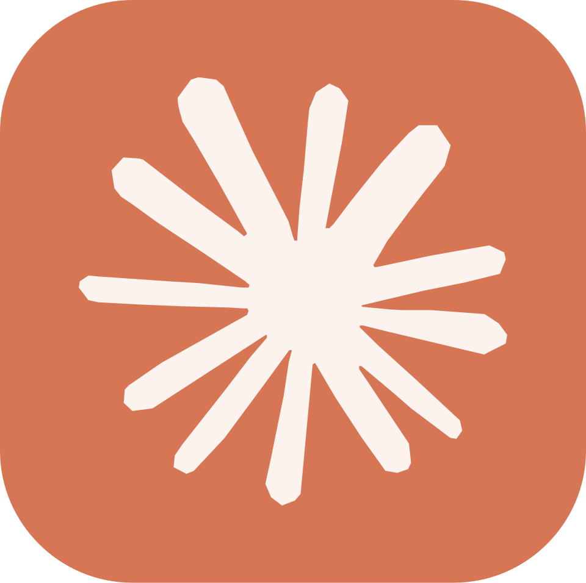
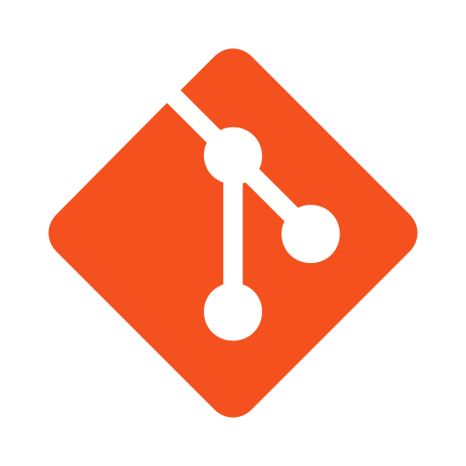
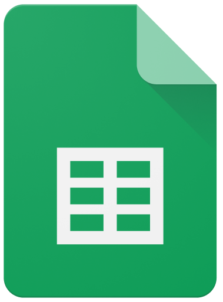
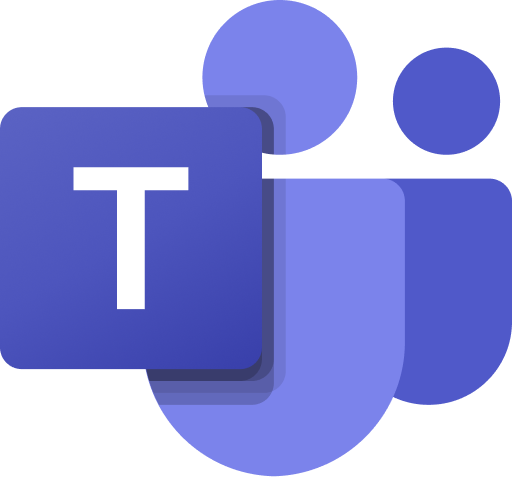
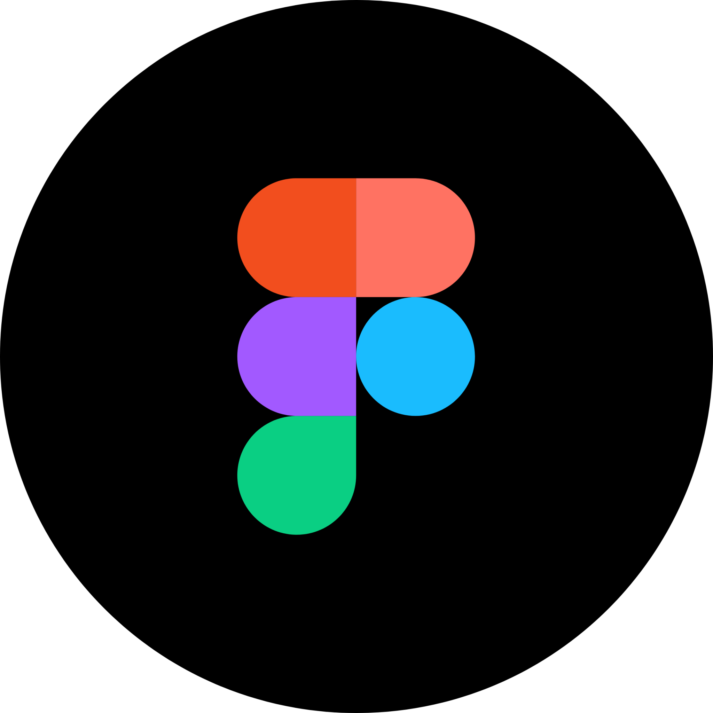

## Introdução

Nesta página, apresentamos as ferramentas escolhidas para o projeto de IHC e descrevemos o uso de cada uma no nosso fluxo de trabalho. Para facilitar a leitura, as ferramentas foram divididas entre as que possuem **uso geral** ao longo de todo o projeto e aquelas introduzidas em **entregas específicas**.

### Ferramentas de Uso Geral

Tabela 1: Ferramentas de uso contínuo

| Logo                                                                                                                   | Ferramenta      | Uso                                                                                                            |
| :--------------------------------------------------------------------------------------------------------------------- | :-------------- | :------------------------------------------------------------------------------------------------------------- |
|  {: style="height: 10px; width: 10px"}             | ChatGPT         | Ferramenta de IA utilizada apenas para suporte em pesquisa e revisão, sem geração de conteúdo para o trabalho. |
|  {: style="height: 10px; width: 10px"}               | Claude          | Ferramenta de IA utilizada apenas para suporte em pesquisa e revisão, sem geração de conteúdo para o trabalho. |
|  {: style="height: 10px; width: 10px"}             | Discord         | Plataforma de comunicação para as reuniões.                                                                    |
|  {: style="height: 10px; width: 10px"}               | Gemini          | Ferramenta de IA utilizada apenas para suporte em pesquisa e revisão, sem geração de conteúdo para o trabalho. |
|  {: style="height: 10px; width: 10px"}                     | Git             | Versionamento e contribuição em grupo para o projeto.                                                          |
|  {: style="height: 10px; width: 10px"}               | GitHub          | Hospedagem do código fonte.                                                                                    |
|  {: style="height: 10px; width: 10px"}   | Github pages    | Deploy do MKdocs diretamente do repositório.                                                                   |
|  {: style="height: 10px; width: 10px"}     | Google Docs     | Editor online de texto em grupo.                                                                               |
|  {: style="height: 10px; width: 10px"} | Google Sheets   | Editor online de planilhas em grupo.                                                                           |
|  {: style="height: 10px; width: 10px"}       | Microsoft Teams | Plataforma de comunicação em grupo.                                                                            |
|  {: style="height: 10px; width: 10px"}                   | Miro            | Espaço de trabalho online em grupo.                                                                            |
|  {: style="height: 10px; width: 10px"}               | MKdocs          | Criação de páginas estáticas.                                                                                  |
|  {: style="height: 10px; width: 10px"}       | NotebookLM      | Ferramenta de IA utilizada apenas para suporte em pesquisa e revisão, sem geração de conteúdo para o trabalho. |
|  {: style="height: 10px; width: 10px"}                     | OBS             | Software para gravação das reuniões e apresentações.                                                           |
|  {: style="height: 10px; width: 10px"}               | Trello          | Ferramenta de gestão de projetos e tarefas utilizando Kanban.                                                  |
|  {: style="height: 10px; width: 10px"}               | Vscode          | Editor de texto para criação e manutenção das páginas estáticas.                                               |
|  {: style="height: 10px; width: 10px"}           | Whatsapp        | Comunicação rápida entre os membros do grupo.                                                                  |
|  {: style="height: 10px; width: 10px"}             | Youtube         | Publicar os vídeos das entregas.                                                                               |

### Ferramentas por Entrega

Tabela 2: Ferramentas utilizadas em entregas específicas

| Logo                                                                                                           | Ferramenta | Entrega           | Uso                                                                                              |
| :------------------------------------------------------------------------------------------------------------- | :--------- | :---------------- | :----------------------------------------------------------------------------------------------- |
|  {: style="height: 10px; width: 10px"} | When2meet  | **Entrega 1**     | Ferramenta para organizar horários disponíveis dos membros da equipe através de um heatmap.      |
|  {: style="height: 10px; width: 10px"}         | Figma      | **Entrega 3 e 6** | Criação do guia de estilo, planejamento e elaboração de protótipos de alta fidelidade e designs. |

## Bibliografia

- [ChatGPT](https://chatgpt.com/)
- [Claude](https://claude.ai/)
- [Discord](https://discord.com/)
- [Figma](https://www.figma.com/)
- [Gemini](https://gemini.google.com/)
- [Git](https://git-scm.com/)
- [GitHub](https://github.com/)
- [GitHub Pages](https://pages.github.com/)
- [Google Docs](https://workspace.google.com/intl/pt-BR/products/docs/)
- [Google Sheets](https://workspace.google.com/intl/pt-BR/products/sheets/)
- [Microsoft Teams](https://www.microsoft.com/pt-br/microsoft-teams/log-in)
- [Miro](https://miro.com/pt/)
- [MKdocs](https://www.mkdocs.org/)
- [NotebookLM](https://notebooklm.google.com/)
- [OBS](https://obsproject.com/)
- [Trello](https://trello.com/pt-BR)
- [Visual Studio Code](https://code.visualstudio.com/)
- [Whatsapp](https://www.whatsapp.com/)
- [When2meet](https://www.when2meet.com/)
- [Youtube](https://www.youtube.com/)

## Versionamento

| Versão | Data       | Descrição                                           | Autor(es/as)                                | Revisor(es/as)                                                                                 |
| :----- | :--------- | :-------------------------------------------------- | :------------------------------------------ | :--------------------------------------------------------------------------------------------- |
| 1.0    | 09/04/2026 | Criação da página de ferramentas                    | [Thiago Gomes](https://github.com/thgomxs)  | [Giovanna Aguiar](https://github.com/giovannabrito19)                                          |
| 1.1    | 11/04/2026 | Adição da ferramenta When2meet                      | [Thiago Gomes](https://github.com/thgomxs)  | [Giovanna Aguiar](https://github.com/giovannabrito19)                                          |
| 1.2    | 11/04/2026 | Correção do versionamento                           | [Rafael Melatti](https://github.com/Romm-0) | [Giovanna Aguiar](https://github.com/giovannabrito19)                                          |
| 1.3    | 12/04/2026 | Adição da ferramenta Microsoft Teams                | [Thiago Gomes](https://github.com/thgomxs)  | [Lucas Gabriel](https://github.com/lucaszg-g)                                                  |
| 1.4    | 13/04/2026 | Adição da ferramenta Trello                         | [Thiago Gomes](https://github.com/thgomxs)  | [Lucas Gabriel](https://github.com/lucaszg-g)                                                  |
| 1.5    | 13/04/2026 | Adição de ferramentas de IA para pesquisa e revisão | [Thiago Gomes](https://github.com/thgomxs)  | [Lucas Gabriel](https://github.com/lucaszg-g)                                                  |
| 1.6    | 14/04/2026 | Adição de nova tabela de ferramentas por entrega    | [Thiago Gomes](https://github.com/thgomxs)  | [Lucas Gabriel](https://github.com/lucaszg-g), [Heyttor Augusto](https://github.com/H3ytt0r62) |
