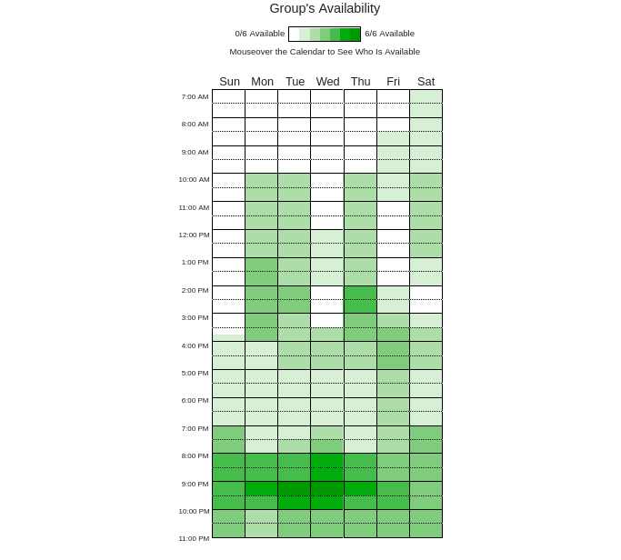

##  Disponibilidade do Grupo - Reuniões

Para a definição dos horários de reunião do projeto, utilizamos a ferramenta **When2Meet** para coletar a disponibilidade de todos os membros. Abaixo está o Heatmap consolidado e a análise dos melhores horários.

### Heatmap de Disponibilidade
 

Elaborado pelos autores com auxílio da plataforma When2meet (2026). Disponível em: <https://www.when2meet.com/?36034800-Slq4M>. Acesso em: 08 abr. 2026.

*Obs: Quanto mais escuro o verde, maior o número de membros disponíveis.*

---

###  Análise de Horários Sugeridos

Com base no Heatmap, os períodos com maior de disponibilidade são:

| Dia da Semana | Horário Principal | Status |
| :--- | :--- | :--- |
| **Terça / Quarta** | 20:00 - 22:00 | **Ideal** |
| **Segunda / Quinta** | 13:00 - 15:30 | **Bom** |

## Versionamento

| Versão | Data | Descrição | Autor(es/as) | Revisor(es/as) |
| :--- | :--- | :--- | :--- | :--- |
| 1.0 | 09/04/2026 | Criação do documento e inicialização do mesmo | [Yasmin Dayhell](https://github.com/YasminDayrell) | [Heyttor Augusto](https://github.com/H3ytt0r62) |
| 1.1 | 11/04/2026 | Correção do versionamento | [Rafael Melatti](https://github.com/Romm-0) | [Giovanna](https://github.com/giovannabrito19), [Heyttor](https://github.com/H3ytt0r62), [João](https://github.com/Blazemorales), [Lucas](https://github.com/lucaszg-g), [Rafael](https://github.com/Romm-0), [Thiago](https://github.com/thgomxs) e [Yasmim](https://github.com/YasminDayrell) |
| 1.2 | 14/04/2026 | Mudança de "equipe" para a lista de membros | [Rafael Melatti](https://github.com/Romm-0) | - |
| 1.3 | 14/04/2026 | Mudança do heatmap | [Lucas Gabriel](https://github.com/lucaszg-g) | - |
