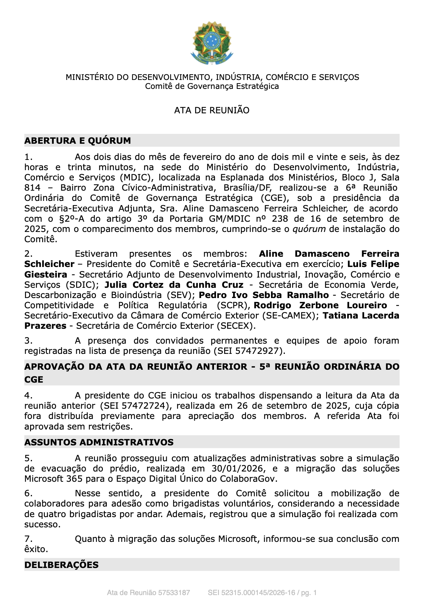
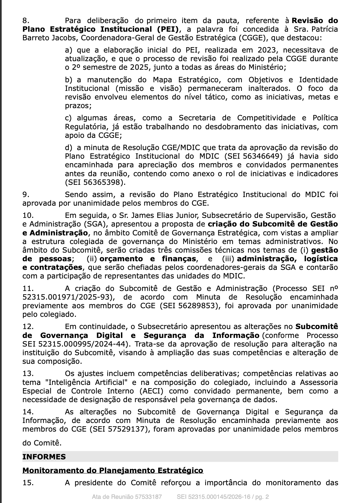
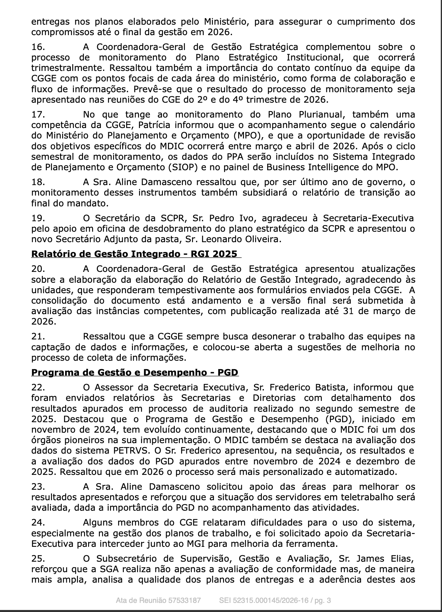
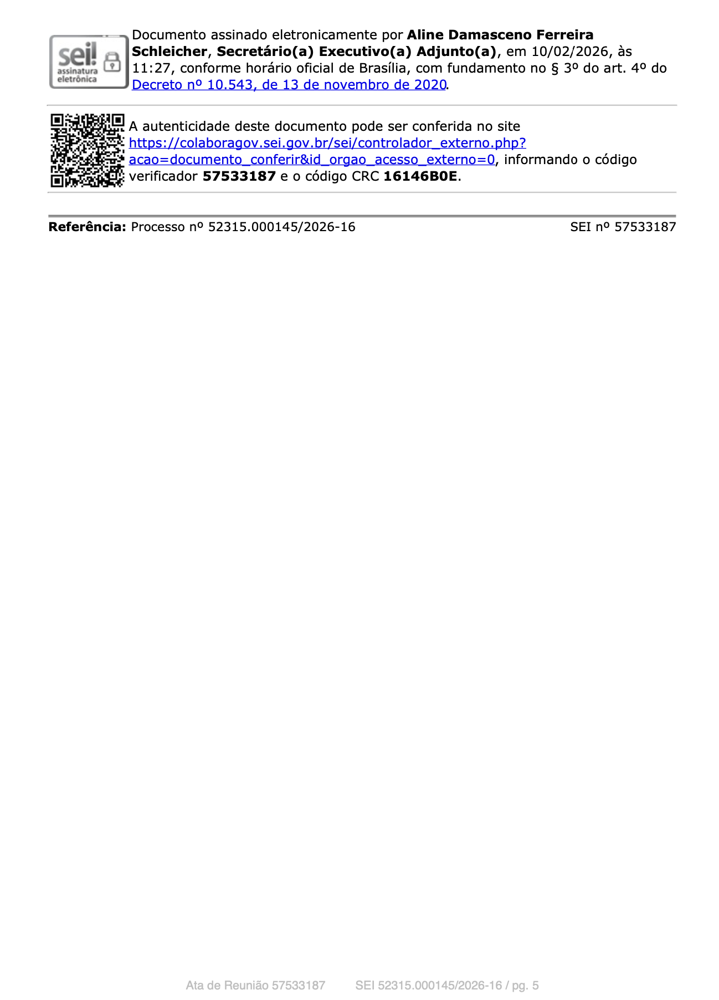

# Modelo de Ata de Reunião

---

## Modelo

 

---

## Referência

Este modelo foi baseado na Ata da 6ª Reunião Ordinária do Comitê de Governança Estratégica (CGE) do MDIC.

---

## Versionamento

| Data       | Tarefa realizada                               | Autor           | Revisor         |
|------------|-----------------------------------------------|----------------|-----------------|
|10/04/2026| Criação do documento e inicialização do mesmo | [Giovanna Aguiar ](https://github.com/giovannabrito19)| [Rafael Melatti](https://github.com/Romm-0) |