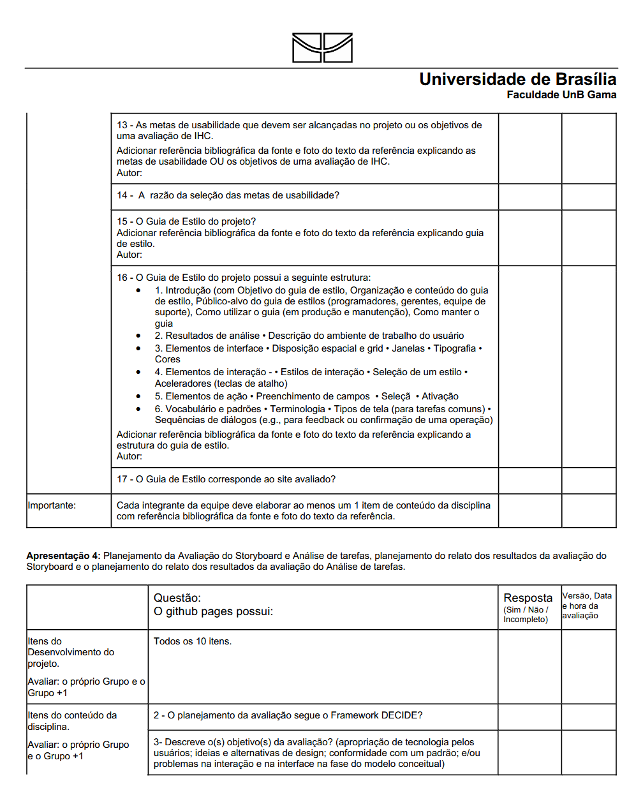
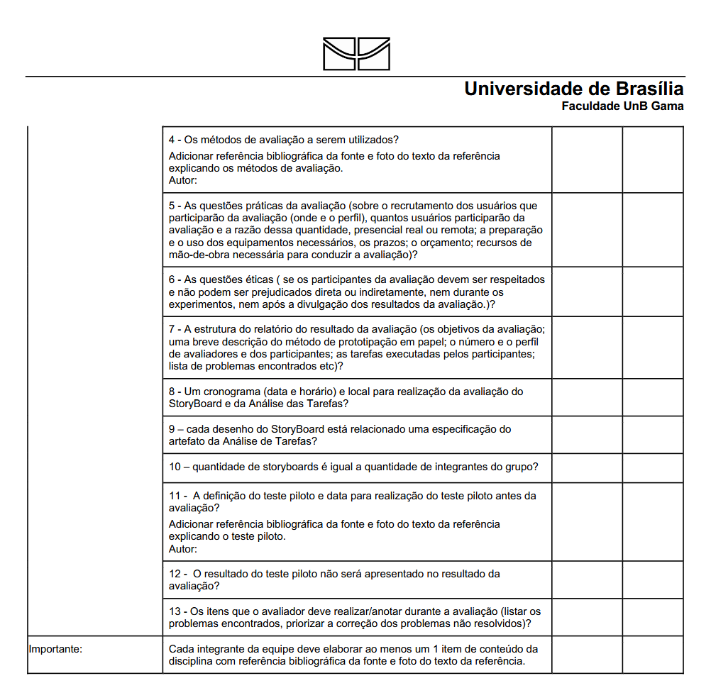

# Modelo de Lista de Verificação

---

## Modelo

 
 
 
 
 

---

## Referência

Este modelo foi baseado na de Lista de Verificação presente no [Plano de Ensino](modelo_inspecao/plano_de_ensino.pdf) disponibilizado pelo professor André Barro de Sales.

---

## Versionamento

| Versão | Data | Descrição | Autor(es/as) | Revisor(es/as) |
| :--- | :--- | :--- | :--- | :--- |
| 1.0 | 10/04/2026 | Criação do documento e inicialização do mesmo | [Rafael Melatti](https://github.com/Romm-0)| - |