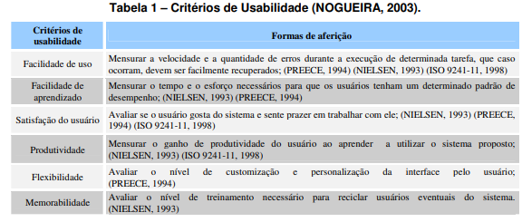
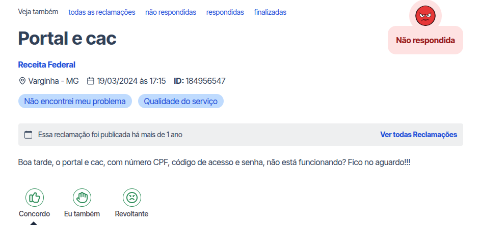

# Projeto de IHC - Grupo 1  
**Professor:** André Barros  

---

## Listas de Sites Selecionados

Os sites selecionados pelo grupo foram os seguintes:

- Agendamento para teste de carga viral de HIV, da Fundação Hemocentro  
- Delegacia Eletrônica da Polícia Civil do Distrito Federal  
- e-CAC, da Receita Federal  
- Serviço de Vacinação da Secretaria de Saúde do Distrito Federal (SES-DF)  
- Secretaria de Educação do Distrito Federal (SEE-DF)  

---

## Site Selecionado

O site selecionado foi o site do **e-CAC**, da Receita Federal.  

---

## Motivação da Escolha do Site

O sistema do e-CAC foi selecionado pois, em uma avaliação com todo o grupo, verificamos a violação de heurísticas nessa plataforma fiscal.  

A verificação foi feita seguindo as Heurísticas mostradas no documento de **MACIEL et al (s.d.)¹**, mostrado na tabela abaixo, que mostra as heurísticas que um site deve possuir. Em caso de algum elemento do site que não atenda a essas heurísticas, temos uma violação de heurística.  

Foto: 

Fonte:  
MACIEL, Cristiano; NOGUEIRA, José Luis T.; CIUFFO, Leandro Neumann; GARCIA, Ana Cristina Bicharra. *Avaliação Heurística de Sítios na Web*. Niterói: Instituto de Computação, Universidade Federal Fluminense (UFF), [s.d.].  
Disponível em: <https://aprender3.unb.br/pluginfile.php/3335989/mod_resource/content/1/Artigo%20Av%20Heur%C3%ADstica%20ac1_55.pdf>.  
Acesso em: 9 de abr. 2026  

Assim, teremos o objetivo do nosso trabalho, que é fazer com que estas requisições sejam atendidas.  

---

## Heurísticas Violadas

### Facilidade de Uso
O e-CAC apresenta grandes defeitos de usabilidade, como:

- Informações confusas  
- Linguagem técnica (difícil de ser compreendida pelo usuário)  
- Fonte pequena  
- Dificuldade de correção de erros (“arrependimento”), como voltar uma página  

Isso dificulta a conclusão das tarefas, aumenta seu tempo de encerramento, ou até mesmo impossibilita a conclusão de atividades do usuário.  

Isso também mostra a violação da **Heurística de PRODUTIVIDADE**.  

Isso foi verificado no site “Reclame Aqui”, conforme a imagem abaixo:

Foto:  

Fonte:  
Securly - Geolocation sharing.  
Disponível em: <https://www.reclameaqui.com.br/receita-federal/portal-e-cac_V4NwsfQBclzOJu_P/>.  
Acesso em: 9 abr. 2026  

---

### Facilidade de Aprendizado
O e-CAC é difícil de ser aprendido pelo usuário, pois não apresenta uma sequência lógica fácil de ser compreendida.  

Ou seja, o usuário não consegue prever quais passos deve seguir.  

---

### Satisfação do Usuário
Elementos como:

- Forma da interface  
- Organização da sequência lógica  

tornam a experiência insatisfatória com o e-CAC.  

Isso também viola a heurística de **PRODUTIVIDADE**, pois a baixa produtividade leva à insatisfação do usuário.  

---

## Referências

1. MACIEL, Cristiano; NOGUEIRA, José Luis T.; CIUFFO, Leandro Neumann; GARCIA, Ana Cristina Bicharra. *Avaliação Heurística de Sítios na Web*. Niterói: Instituto de Computação, Universidade Federal Fluminense (UFF), [2004?].  
   Disponível em: <https://aprender3.unb.br/pluginfile.php/3335989/mod_resource/content/1/Artigo%20Av%20Heur%C3%ADstica%20ac1_55.pdf>.  
   Acesso em: 9 de abr. 2026  

2. Securly - Geolocation sharing.  
   Disponível em: <https://www.reclameaqui.com.br/receita-federal/portal-e-cac_V4NwsfQBclzOJu_P/>.  
   Acesso em: 9 abr. 2026  
